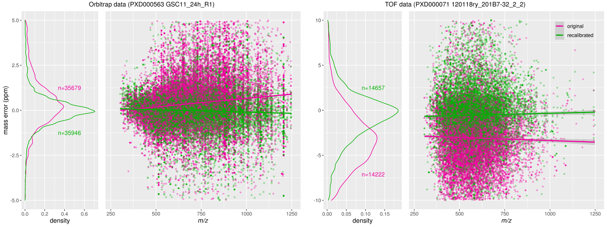

# Aim of the program
mzrecal can be used to recalibrate mass spectrometry data in mzML format.

Check section [Usage](#usage) for a more complete description.

# Running mzRecal
Ready-to-run executables of mzRecal for Linux and Microsoft Windows can be downloaded from https://github.com/524D/mzrecal/releases. These executables have no external dependencies.

# Compiling
The core of the program is written in [Go](https://golang.org/). A relatively
small part is written in the C language, this is required to access the GSL
library which is used to compute the recalibration parameters.

On Ubuntu 20.04, to install the prerequisites and download/build the code:

```
sudo apt install golang gcc libgsl-dev git
go get -ldflags '-extldflags "-static"' github.com/524D/mzrecal
```

The resulting executable program can then be found at `~/go/bin/mzrecal`.

# Input and output
mzrecal uses file formats specified by the Proteomics Standards Initiative 
(PSI), notably [mzML](http://www.psidev.info/mzML) and [mzIdentML](http://www.psidev.info/mzidentml).

For recalibration, a peak-picked mzML file and corresponding
mzIdentML (file extension .mzid) file are needed as input.
Running `mzrecal` produces a recalibrated mzML file, plus a file with recalibration
parameters (.json format). The latter can be used to manually inspect 
the calibration for each spectrum.

Note that the output mzML file will not contain the index wrapper
(which is optional according to the mzML specification, but still required by
some software). The [msconvert](http://proteowizard.sourceforge.net/download.html)
program from the ProteoWizard toolkit is recommended to add the index.

The sample below shows the start, middle and end of a .json file with
recalibration parameters.

```json
{
  "MzRecalVersion": "1.0",
  "RecalMethod": "Orbitrap",
  "SpecRecalPar": [
    {
      "SpecIndex": 0,
      "P": null,
      "CalsInRTWindow": 7,
      "CalsInMassWindow": 0,
      "CalsUsed": 0
    },
...
    {
      "SpecIndex": 2135,
      "P": [
        9.673208098942699e-8,
        1.000000105563597
      ],
      "CalsInRTWindow": 42,
      "CalsInMassWindow": 16,
      "CalsUsed": 14
    },
...
    {
      "SpecIndex": 8856,
      "P": [
        8.562906413578675e-8,
        1.0000000197806953
      ],
      "CalsInRTWindow": 7,
      "CalsInMassWindow": 4,
      "CalsUsed": 4
    }
  ]
}

```


# Results
Recalibration affects the MS1 spectra as well as the precursor masses of the
MS2 spectra. Search engines commonly report the difference between theoretical
mass and measured mass for identified peptides. The following plot shows the
improvement of mzRecal on a TOF dataset.


# Go packages for mzML and mzIdentML
The current version of the code embeds two internal Go packages, one for reading
mzIdentML and one for reading/writing mzML files. These packages will likely
be split into a separate module at a later time.

# <a name="usage"></a>Usage

The following is printed by running mzrecal -help

```text
USAGE:
  mzrecal [options] <mzMLfile>

  This program can be used to recalibrate MS data in an mzML file
  using peptide identifications in an accompanying mzID file.

OPTIONS:
  -cal string
    	filename for output of computed calibration parameters
  -calmult int
    	only the topmost (<calmult> * <number of potential calibrants>)
    	peaks are considered for computing the recalibration. <1 means all peaks. (default 10)
  -charge string
    	charge range of calibrants, or the string "ident". If set to "ident",
    	only the charge as found in the mzIdentMl file will be used for calibration. (default "1:5")
  -debug string
    	Print debug output for given spectrum range e.g. 3:6
  -empty-non-calibrated
    	Empty MS2 spectra for which the precursor was not recalibrated.
  -func string
    	recalibration function to apply. If empty, a suitable
    	function is determined from the instrument specified in the mzML file.
    	Valid function names:
    	    FTICR, TOF, Orbitrap: Calibration function suitable for these instruments.
    	    POLY<N>: Polynomial with degee <N> (range 1:5)
    	    OFFSET: Constant m/z offset per spectrum.
  -mincals int
    	minimum number of calibrants a spectrum should have to be recalibrated.
    	If 0, the minimum number of calibrants is set to the smallest number needed
    	for the choosen recalibration function plus one. In any other case, is the
    	specified number is too low for the calibration function, it is increased to
    	the minimum needed value.
  -minpeak float
    	minimum peak intensity to consider for computing the recalibration.
  -mzid string
    	mzIdentMl filename
  -o string
    	filename of recalibrated mzML
  -ppmcal float
    	max mz error (ppm) for accepting a calibrant for calibration (default 2)
  -ppmuncal float
    	max mz error (ppm) for trying to use calibrant for calibration (default 10)
  -rt string
    	rt window (s) (default "-10.0:10.0")
  -scorefilter string
    	filter for PSM scores to accept. Format:
    	<CVterm1|scorename1>([<minscore1>]:[<maxscore1>])...
    	When multiple score names/CV terms are specified, the first one on the list
    	that matches a score in the input file will be used.
    	TODO: The default contains reasonable values for some common search engines
    	and post-search scoring software:
    	  MS:1002257 (Comet:expectation value)
    	  MS:1001159 (SEQUEST:expectation value)
    	  MS:1002466 (PeptideShaker PSM score) (default "MS:1002466(0.99:)MS:1002257(0.0:1e-2)MS:1001159(0.0:1e-2)")
  -stage int
    	0: do all calibration stages in one run
    	1: only compute recalibration parameters
    	2: perform recalibration using previously computer parameters
    	NOTE: The mzML file that is produced after recalibration does not contain an
    	      index. If an index is required, we recommend post-processing the output file 
    	      with msconvert (http://proteowizard.sourceforge.net/download.html).
  -version
    	Show software version

BUILD-IN CALIBRANTS:
  In addition to the identified peptides, mzrecal will also use
  for recalibration a number of compounds that are commonly found in many
  samples. These compound are all assumed to have +1 charge. The following
  list shows the build-in compounds with their (uncharged) masses:
     cyclosiloxane6 (444.112748)
     cyclosiloxane7 (518.131539)
     cyclosiloxane8 (592.150331)
     cyclosiloxane9 (666.169122)
     cyclosiloxane10 (740.187913)
     cyclosiloxane11 (814.206705)
     cyclosiloxane12 (888.225496)

EXECUTION STAGES:
    Recalibration consists of 2 stages. By default they are executed consequtively,
    but it is also possible to execute them seperately by specifying the -stage flag:
    1) Computation of recalibration coefficients. The coefficients are stored
        in a JSON file.
        This stage reads an mzML file and mzID file, matches measured peaks to
        computed m/z values and computes recalibration coefficents using a method
        that is usefull for the instrument type. The instrument type (and other
        relavant values) are determined from the CV terms in the input files.
    2) Creating a recalibrated version of the MS file.
        This stage reads the mzML file and JSON file with recalibration values,
        computes recalibrated m/z values for all peaks in spectra for which
        a valid recalibration was found, and writes a recalibrated mzML file.

USAGE EXAMPLES:
  mzrecal BSA.mzML
    Recalibrate BSA.mzML using identifications in BSA.mzid, write recalibrated
    result to BSA-recal.mzML and write recalibration coefficients BSA-recal.json.
    Default parameters are used. 

  mzrecal -ppmuncal 20 -ppmcal 1.5 BSA.mzML
    Idem, but accept peptides with 20 ppm as potential calibrants, after
    recalibration all accepted peptides must be within 1.5 ppm

  mzrecal -calmult 20
    Idem, but the number of peaks that are considered for matching are the
    number of potential calibrants times 20
```

# Acknowledgements
The recalibration algorithm was originally developed by Magnus Palmblad (see also 
[recal2](http://www.ms-utils.org/recal2.html)).

# Funding
mzRecal was made possible in part due to funding from the ELIXIR Implementation Study "Crowd-sourcing the annotation of public proteomics datasets to improve data reusability".
